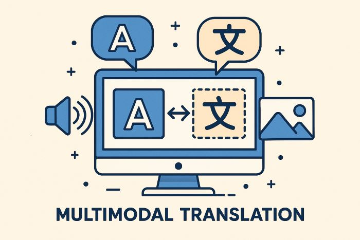

|logo|

`The Era of Multimodal Translation <https://www.kantanai.io/localization-now-the-era-of-multimodal-translation/>`_

| Multimodal translation is an advanced form of communication and translation that integrates and interprets information
  from various sources, such as text, images, audio, and video, to convey a message accurately.
  `What is multimodal translation? <https://www.educative.io/answers/what-is-multimodal-translation/>`_

|

`Technical Specification <./TechnicalSpec.rst>`_

